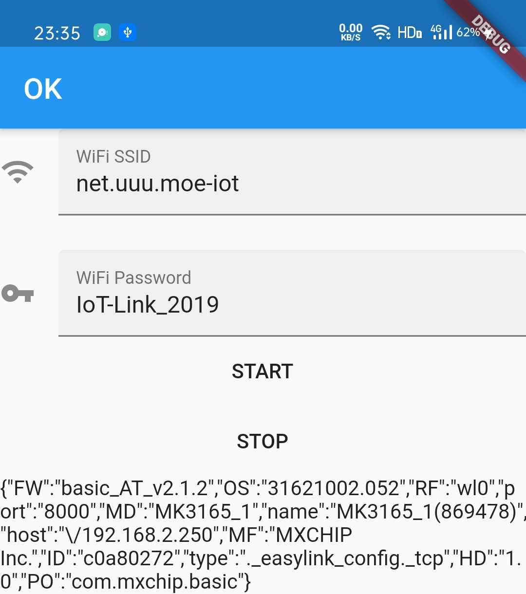
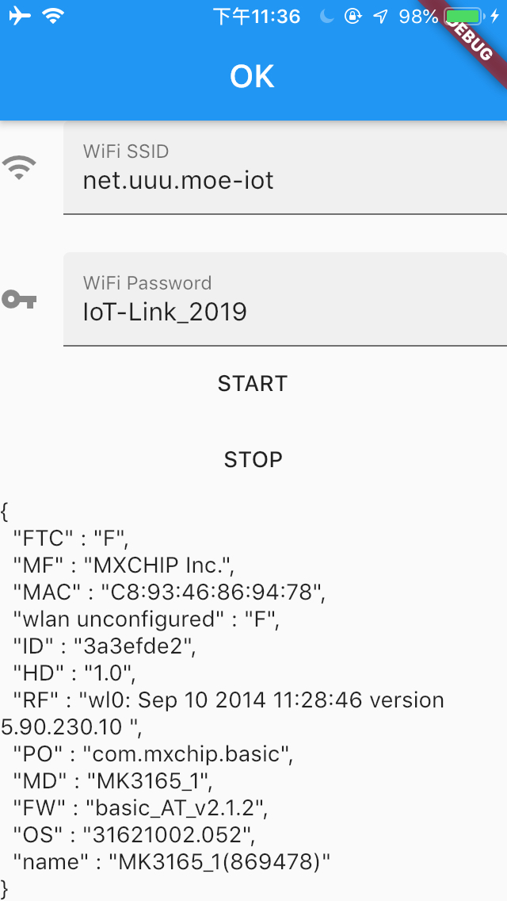

# EasylinkFlutter

对基于 MXCHIP/MXOS 的 IoT WiFi 硬件模组进行无线网络设置的发送工作的 Flutter 插件。

支持平台： Android, iOS.

## 使用方法

1. 引入本插件。
  - 修改 `pubspec.yaml` 文件，在 `dependencies:` 里面加入：
```
  easylink_flutter:
    git:
      url: https://github.com/kagurazakayashi/EasylinkFlutter.git
```
2. 向用户索取「位置服务」权限（在 iOS > 12 或 Android > 8 时）。
  - 要获得当前 SSID ，「位置服务」权限是必须的。
  - 如果让用户自己输入网络名，可以跳过本步骤和下一步骤。
  - 示例程序中使用的权限获取插件是 `permission_handler` 。
3. 获取 SSID 。
  - 调用 `EasylinkFlutter.getwifiinfo()` ，可以获得一个包含各种信息的字典。
  - 该字典(Map)通常包括三个字符串数据 `[BSSID,SSID,SSIDDATA]` 。
  - 下面是一个示例：
```
  Future<void> getssid() async {
    try {
      Map wifiinfo = await EasylinkFlutter.getwifiinfo();
      print(wifiinfo["SSID"]);
    } on PlatformException {
      print("ERROR");
    }
  }
```
4. 开始配网。
  - 调用 `EasylinkFlutter.linkstart` ，该方法需要以下参数：
    - `ssid`: Wi-Fi 网络名
    - `password`: Wi-Fi 网络密码
    - `mode`: EasyLink 的模式，可选项：
      - `EASYLINK_V1`,`EASYLINK_V2`,`EASYLINK_PLUS`,`EASYLINK_V2_PLUS`,`EASYLINK_AWS`,`EASYLINK_SOFT_AP`,`EASYLINK_MODE_MAX`。
      - 示例使用的是 `EasyLinkMode.EASYLINK_V2_PLUS`，安卓只支持此项（此项包括V1和V2）。
    - `timeout`: 超时时间
  - 方法会返回一个字符串状态信息。
  - 下面是一个示例：
```
  await EasylinkFlutter.linkstart(
    ssid: "testwifi",
    password: "testpwd",
    mode: EasyLinkMode.EASYLINK_V2_PLUS,
    timeout: 60
  );
```
5. 监听返回通知
  - 使用 `EasyLinkNotification.instance.addObserver('linkstate', (object)` 来监听通知。
  - `object` 是 `String` 类型，可以返回以下内容：
    - `Start`: 开始执行
    - `Stop`: 执行结束、终止、超时
    - `Unknown`: 状态未知
    - 其他 String: 错误信息
    - JSON: 成功，插件将设备返回的详细信息解析整理为 JSON 返回，内容为字符串字典类型。
  - 下面是一个示例：
```
  try {
    EasyLinkNotification.instance.addObserver('linkstate', (object) {
      setState(() {
        String cbstr = object;
        if (cbstr != "Stop" && cbstr != "Unknown") {
          EasylinkFlutter.linkstop();
        }
        if (cbstr.substring(0,1) == "{") { //是 JSON
          _jsoninfo = object;
          _displayinfo = "OK!";
        } else {
          _displayinfo = object;
        }
      });
      EasyLinkNotification.instance.removeNotification('linkstate');
    });
  } on PlatformException {
    displayinfo = 'ERROR!';
  }
```

## 注意事项

1. Android 版加入插件前，需要修改 `android\app\src\main\AndroidManifest.xml` 文件：
  - 在 `<manifest>` 节点添加 `xmlns:tools="http://schemas.android.com/tools"`
  - 在 `<application>` 节点添加 `tools:replace="android:label"`
2. 在 iOS > 12 或 Android > 8 时，要获取 WiFi 网络名称必须先拥有「位置服务」权限。

## 支持版本

- `EASYLINK_V2`
- `EASYLINK_V3`
- `EASYLINK_PLUS`

不支持 `EasylinkP2P`

## 截图（找到设备并返回由设备提供的信息）

Android:



iOS:

