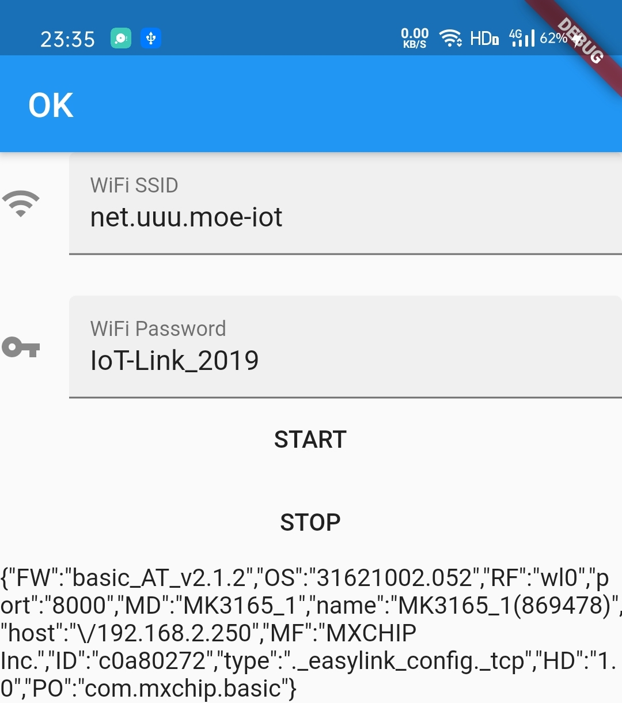
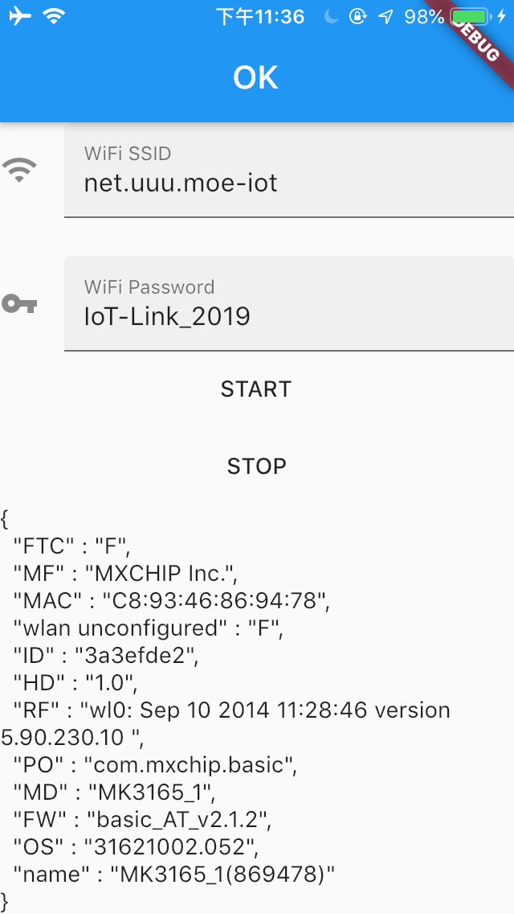

# EasylinkFlutter

对基于 MXCHIP/MXOS 的 IoT WiFi 硬件模组进行无线网络设置的发送工作的 Flutter 插件。

支持平台： Android, iOS.

## 环境要求

| 项目 | 版本 |
| --- | --- |
| Flutter | 3.47 及以上（stable） |
| Dart | 3.13 及以上 |
| Android minSdk | 24 |
| Android compileSdk | 37（SDK 平台包目录为 `android-37.0`） |
| Gradle / AGP / Kotlin | 9.3.1 / 9.1.0 / 2.4.0 |
| Java | 17 |

构建脚本使用 Kotlin DSL（`*.gradle.kts`），Android SDK 需安装 `platforms;android-37.0`。

## 使用方法

1. 引入本插件。
   - 修改 `pubspec.yaml` 文件，在 `dependencies:` 里面加入：

```
  easylink_flutter:
    git:
      url: https://github.com/kagurazakayashi/EasylinkFlutter.git
```

2. 向用户索取「位置服务」权限（在 iOS > 12 或 Android > 8 时）。
   - 要获得当前 SSID ，「位置服务」权限是必须的。
   - 如果让用户自己输入网络名，可以跳过本步骤和下一步骤。
   - 示例程序中使用的权限获取插件是 `permission_handler` 。
3. 获取 SSID 。
   - 调用 `EasyLink.getwifiinfo()` ，可以获得一个包含各种信息的字典。
   - 该字典(Map)通常包括三个字符串数据 `[BSSID,SSID,SSIDDATA]` 。
   - 下面是一个示例：

```
  Future<void> getssid() async {
    final EasyLink easyLink = EasyLink();
    try {
      Map? wifiinfo = await easyLink.getwifiinfo();
      print(wifiinfo["SSID"]);
    } on PlatformException {
      print("ERROR");
    }
  }
```

4. 开始配网。
   - 调用 `EasyLink.linkstart` ，该方法需要以下参数：
     - `ssid`: Wi-Fi 网络名
     - `password`: Wi-Fi 网络密码
     - `mode`: EasyLink 的模式，可选项：
       - `EASYLINK_V1`,`EASYLINK_V2`,`EASYLINK_PLUS`,`EASYLINK_V2_PLUS`,`EASYLINK_AWS`,`EASYLINK_SOFT_AP`,`EASYLINK_MODE_MAX`。
       - 示例使用的是 `EasyLinkMode.EASYLINK_V2_PLUS`，安卓只支持此项（此项包括V1和V2）。
     - `timeout`: 超时时间
   - 方法会返回一个字符串状态信息。
   - 下面是一个示例：

```
  await easyLink.linkstart(
    ssid: "testwifi",
    password: "testpwd",
    mode: EasyLinkMode.EASYLINK_V2_PLUS,
    timeout: 60
  );
```

5. 监听返回通知
   - 使用 `EasyLinkNotification.instance.addObserver('linkstate', (object)` 来监听通知。
   - `object` 是 `String` 类型，可以返回以下内容：
     - `Start`: 开始执行
     - `Stop`: 执行结束、终止、超时
     - `Unknown`: 状态未知
     - 其他 String: 错误信息
     - JSON: 成功，插件将设备返回的详细信息解析整理为 JSON 返回，内容为字符串字典类型。
   - 下面是一个示例：

```
  try {
    EasyLinkNotification.instance.addObserver('linkstate', (object) {
      setState(() {
        String cbstr = object;
        if (cbstr != "Stop" && cbstr != "Unknown") {
          easyLink.linkstop();
        }
        if (cbstr.substring(0,1) == "{") { //是 JSON
          _jsoninfo = object;
          _displayinfo = "OK!";
        } else {
          _displayinfo = object;
        }
      });
      EasyLinkNotification.instance.removeNotification('linkstate');
    });
  } on PlatformException {
    displayinfo = 'ERROR!';
  }
```

## 注意事项

1. Android 版加入插件前，需要修改 `android/app/src/main/AndroidManifest.xml` 文件：
   - 在 `<manifest>` 节点添加 `xmlns:tools="http://schemas.android.com/tools"`
   - 在 `<application>` 节点添加 `tools:replace="android:label"`
   - 原因：`easylinkv3` 的 AAR 自带 `<application android:label>` 节点，需要合并时替换。
2. 在 iOS > 12 或 Android > 8 时，要获取 WiFi 网络名称必须先拥有「位置服务」权限。
3. 插件依赖的 `io.fogcloud.sdk:easylinkv3` 原本只发布在 jcenter，插件已在构建脚本中改为从阿里云 jcenter 镜像获取。
   - 该依赖传递声明的 `com.android.support:appcompat-v7` 已与 AndroidX 冲突，插件已将其排除。
   - 该依赖要求 `compileSdk` 为 37；示例工程通过 `androidComponents.finalizeDsl` 与 `compileSdkMinor = 0` 解析到 `android-37.0` 平台包。

## 支持版本

- `EASYLINK_V2`
- `EASYLINK_V3`
- `EASYLINK_PLUS`

不支持 `EasylinkP2P`

## 截图（找到设备并返回由设备提供的信息）

Android:



iOS:


